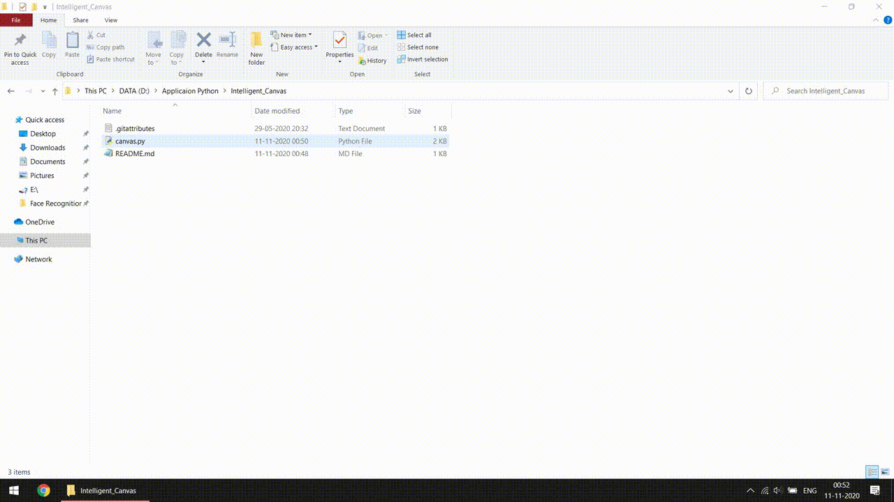

# Intelligent_Canvas
This project is an attempt to implement a module of [Microsoft's Sketch2code](https://sketch2code.azurewebsites.net/)


### Prerequisites
This program was implemented using Python 3.6 and uses two external libraries
1. opencv
2. numpy

You can install these packages by following command.
```
$ pip install opencv-python
$ pip install numpy
```
### Approach
```
1. Draw the required rectangle of relative size which refers to textbox.
2. Extract the top-left coordinate and bottom-right coordinate.
3. Embed this position in HTML code.
```
### Demo
Here I'm drawing the textbox and the program will auto embed the coordinates in HTML code and generate html.index with textbox of relative size.


 
